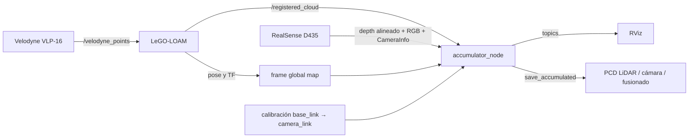

# AGV-Mapping

Wiki técnica del sistema de mapeo 3D para un AGV Scout. El proyecto integra un LiDAR Velodyne VLP-16, una Intel RealSense D435, LeGO-LOAM y un acumulador propio sobre ROS Melodic para generar mapas PCD LiDAR, RGB-D y fusionados.

> Esta guía describe el árbol actual del pipeline PCD.

## Índice

- [Arquitectura](#arquitectura)
- [Recorrido por el repositorio](#recorrido-por-el-repositorio)
- [Flujo de datos y TF](#flujo-de-datos-y-tf)
- [Interfaces ROS](#interfaces-ros)
- [Compilación](#compilación)
- [Uso](#uso)
- [Calibración cámara-LiDAR](#calibración-cámara-lidar)
- [Configuración](#configuración)
- [Salidas](#salidas)
- [Diagnóstico](#diagnóstico)
- [Limitaciones conocidas](#limitaciones-conocidas)
- [Desarrollo](#desarrollo)

## Arquitectura

[`catkin_ws/scripts/start_lidar_mapping.sh`](catkin_ws/scripts/start_lidar_mapping.sh) es el punto de entrada operativo. Arranca cada componente como proceso en segundo plano, guarda su PID y separa sus logs.



| Componente | Responsabilidad |
| --- | --- |
| [`start_lidar_mapping.sh`](catkin_ws/scripts/start_lidar_mapping.sh) | Orquesta sensores, LeGO-LOAM, acumulador, RViz y logs. |
| [`accumulator.cpp`](catkin_ws/src/scout_pointcloud_accumulator/src/accumulator.cpp) | Transforma, filtra, acumula, publica y guarda las nubes. |
| [`accumulate.launch`](catkin_ws/src/scout_pointcloud_accumulator/launch/accumulate.launch) | Configura el acumulador y la TF estática de cámara; no inicia sensores. |
| [`realsense_mapping.launch`](catkin_ws/src/scout_pointcloud_accumulator/launch/realsense_mapping.launch) | Configura profundidad/color alineados de RealSense. |
| [`run.launch`](catkin_ws/src/LeGO-LOAM/LeGO-LOAM/launch/run.launch) | Inicia los cuatro nodos principales de LeGO-LOAM. |
| [`open_rslidar.launch`](catkin_ws/src/scout_base/scout_bringup/launch/open_rslidar.launch) | Inicia el pipeline Velodyne y la TF `base_link → velodyne`. El nombre es histórico. |

El acumulador realiza seis pasos: carga parámetros; crea los suscriptores habilitados; transforma cada medida a `target_frame`; aplica filtros voxel independientes; publica nubes instantáneas/acumuladas; y escribe PCD al recibir el servicio de guardado.

## Recorrido por el repositorio

```text
AGV-Mapping/
├── README.md                         esta wiki
├── catkin_ws/
│   ├── scripts/                      operación, vistas, diagnóstico y calibración
│   └── src/
│       ├── scout_pointcloud_accumulator/  código propio de acumulación/fusión
│       ├── LeGO-LOAM/                registro y odometría LiDAR
│       ├── velodyne/                 driver y conversión del VLP-16
│       ├── realsense/                driver ROS de RealSense
│       ├── scout_base/ y ugv_sdk/    soporte del AGV AgileX
│       ├── navigation/               GMapping y conversión a LaserScan
│       └── rf2o_laser_odometry/      odometría láser 2D alternativa
├── maps/                             mapas generados
├── agv_mapping/                      PID y logs de ejecución
└── agv_mapping_test/                 evidencia de pruebas de campo
```

El código específico del proyecto se concentra en [`scout_pointcloud_accumulator`](catkin_ws/src/scout_pointcloud_accumulator/). Los demás subárboles son algoritmos, drivers y paquetes ROS integrados.

## Flujo de datos y TF

### LiDAR

```text
/velodyne_points → LeGO-LOAM → /registered_cloud → TF a map
→ eliminación de puntos inválidos → voxel grid → nube acumulada → PCD
```

### Cámara

Por defecto, el acumulador consume la nube XYZRGB nativa:

- `/camera/depth/color/points`

La ruta alternativa por profundidad alineada usa:

- `/camera/aligned_depth_to_color/image_raw`
- `/camera/color/image_raw`
- `/camera/color/camera_info`

Los puntos se limitan por rango, se transforman a `map`, se submuestrean y se incorporan a la nube RGB.

### Transformaciones

El frame global y `Fixed Frame` de RViz es `map`. La cadena crítica es conceptualmente:

```text
map → trayectoria LeGO-LOAM → base_link → camera_link → frames ópticos RealSense
```

La extrínseca de cámara se carga desde [`camera_lidar_calibration.yaml`](catkin_ws/src/scout_pointcloud_accumulator/config/camera_lidar_calibration.yaml). Una TF incorrecta produce desplazamiento, doble pared o un abanico vertical.

## Interfaces ROS

### Entradas

| Topic | Uso |
| --- | --- |
| `/velodyne_points` | Nube cruda que consume LeGO-LOAM. |
| `/registered_cloud` | Nube LiDAR registrada que consume el acumulador. |
| `/camera/aligned_depth_to_color/image_raw` | Profundidad alineada con RGB. |
| `/camera/color/image_raw` | Imagen de color. |
| `/camera/color/camera_info` | Intrínsecos de cámara. |
| `/camera/depth/color/points` | Entrada alternativa `PointCloud2` de cámara. |

### Salidas

| Topic o servicio | Contenido |
| --- | --- |
| `/accumulated_points` | Alias histórico de la nube LiDAR acumulada. |
| `/accumulated_lidar_points` | LiDAR acumulado XYZ + intensidad. |
| `/accumulated_camera_points` | Cámara acumulada XYZRGB. |
| `/camera/colored_points` | Nube RGB instantánea reconstruida. |
| `/accumulator_node/save_accumulated` | Servicio `std_srvs/Empty` que guarda los PCD. |

## Compilación

Requisitos principales: ROS Melodic, Catkin, PCL, los drivers del Velodyne/RealSense y acceso al hardware. ROS Melodic suele ejecutarse sobre Ubuntu 18.04; las versiones exactas del SDK y firmware no están fijadas en el repositorio.

```bash
cd catkin_ws
source /opt/ros/melodic/setup.bash
catkin_make --pkg lego_loam scout_pointcloud_accumulator
source devel/setup.bash
```

Para compilar todos los paquetes, sustituya el comando por `catkin_make`.

## Uso

Los comandos parten de la raíz del repositorio.

### Iniciar

```bash
cd catkin_ws
./scripts/start_lidar_mapping.sh
```

Por defecto, los mapas se escriben en `../maps`, los logs en `../agv_mapping/logs` y los PID en `../agv_mapping/pids`.

Variantes:

```bash
# Sin RViz
RVIZ=false ./scripts/start_lidar_mapping.sh

# Solo LiDAR o solo cámara en los archivos de salida
SAVE_LIDAR=true SAVE_CAMERA=false ./scripts/start_lidar_mapping.sh
SAVE_LIDAR=false SAVE_CAMERA=true ./scripts/start_lidar_mapping.sh

# Directorio de salida explícito
./scripts/start_lidar_mapping.sh /ruta/a/mapas
```

### Guardar y detener

```bash
./scripts/save_accumulated_map.sh
./scripts/stop_lidar_mapping.sh
```

La parada intenta guardar primero y aplica un timeout de 30 segundos. Para una sesión importante, guarde explícitamente y compruebe el resultado antes de detener.

### Visualizar

```bash
rviz -d src/scout_pointcloud_accumulator/rviz/accum.rviz
./scripts/view_realsense.sh
./scripts/view_rgb_camera.sh
./scripts/view_latest_pcd.sh ../maps
```

## Calibración cámara-LiDAR

El modo de calibración inicia ambos sensores y permite ajustar interactivamente `base_link → camera_link`. No arranca el acumulador ni guarda mapas.

```bash
cd catkin_ws
./scripts/start_camera_lidar_calibration.sh
```

Órdenes: `x+`, `x-`, `y+`, `y-`, `z+`, `z-`, `roll+`, `pitch+`, `yaw+`, `step`, `rstep`, `show`, `save` y `quit`. `save` actualiza [`camera_lidar_calibration.yaml`](catkin_ws/src/scout_pointcloud_accumulator/config/camera_lidar_calibration.yaml). La vista está en [`calibration.rviz`](catkin_ws/src/scout_pointcloud_accumulator/rviz/calibration.rviz).

## Configuración

| Variable | Valor inicial | Efecto |
| --- | --- | --- |
| `TARGET_FRAME` | `map` | Frame común de acumulación. |
| `CAMERA_VISUALIZATION_FRAME` | `camera_depth_optical_frame` | Frame de la nube instantánea; permite ver la cámara sin depender de la odometría LiDAR. |
| `RVIZ_FIXED_FRAME` | `camera_depth_optical_frame` | Frame inicial de RViz; use `map` si la TF global ya está disponible al arrancar. |
| `LIDAR_TOPIC` | `/registered_cloud` | Entrada LiDAR registrada. |
| `LIDAR_RAW_TOPIC` | `/velodyne_points` | Entrada LiDAR instantánea y topic usado para validar paquetes al arrancar. |
| `LIDAR_DEVICE_IP` | `192.168.8.201` | Dirección del VLP-16 aceptada por el driver. |
| `LIDAR_HOST_IP` | `192.168.8.174` | Destino configurado en el VLP-16; debe estar asignado al Xavier. |
| `LIDAR_DATA_PORT` | `2368` | Puerto UDP de datos del VLP-16. |
| `LIDAR_READY_TIMEOUT` | `15` s | Espera máxima de paquetes LiDAR antes de abortar con diagnóstico de red. |
| `ENABLE_LIDAR`, `ENABLE_CAMERA` | `true`, `true` | Habilita cada fuente. |
| `SAVE_LIDAR`, `SAVE_CAMERA` | `true`, `true` | Controla los PCD generados. |
| `LIDAR_VOXEL_SIZE` | `0.05` m | Resolución del mapa LiDAR. |
| `CAMERA_VOXEL_SIZE` | `0.05` m | Resolución del mapa RGB. |
| `CAMERA_VISUALIZATION_VOXEL_SIZE` | `0.02` m | Resolución RGB para RViz. |
| `CAMERA_ACCUMULATE_RATE` | `1.0` Hz | Frecuencia de incorporación al mapa. |
| `CAMERA_MIN_RANGE`, `CAMERA_MAX_RANGE` | `0.20`, `5.0` m | Profundidad aceptada. |
| `CAMERA_DEPTH_PIXEL_STEP` | `2` | Submuestreo de profundidad. |
| `CAMERA_CALIBRATION_FILE` | YAML del paquete | Extrínseca de cámara. |
| `TRANSFORM_TIMEOUT` | `0.5` s | Espera máxima de TF. |
| `USE_LATEST_TF_ON_FAILURE` | `false` | Usa la última TF como fallback; puede ocultar fallos temporales. |
| `REALSENSE_INITIAL_RESET` | `false` | Evita reiniciar la cámara en cada arranque; actívelo sólo para recuperación explícita. |
| `CAMERA_READY_SAMPLE_MESSAGES` | `4` | Mensajes consecutivos exigidos para considerar estable una nube de cámara. |
| `CAMERA_READY_SAMPLE_TIMEOUT_SEC` | `5` s | Tiempo máximo para recibir esa muestra; tolera el arranque del suscriptor sin aceptar flujos detenidos. |
| `REALSENSE_READY_TIMEOUT` | `30` s | Límite para validar depth, color y CameraInfo. |
| `CAMERA_OUTPUT_READY_TIMEOUT` | `30` s | Límite para validar `/camera/colored_points` tras arrancar el acumulador. |
| `LEGO_USE_IMU` | `false` | Activa la IMU de LeGO-LOAM. |
| `LEGO_LOCK_ROLL_PITCH` | `true` | Limita deriva de roll/pitch. |

`CAMERA_PARENT_FRAME`, `CAMERA_CHILD_FRAME`, `CAMERA_XYZ` y `CAMERA_RPY` definidos en el entorno prevalecen sobre el YAML.

## Salidas

Una sesión usa un prefijo como `maps/map_YYYYMMDD_HHMMSS` y puede escribir:

| Archivo | Formato |
| --- | --- |
| `*_lidar.pcd` | LiDAR `PointXYZI`. |
| `*_camera.pcd` | RealSense `PointXYZRGB`. |
| `*_fused.pcd` | LiDAR convertido a gris + cámara RGB. |

`maps/`, `agv_mapping/` y `agv_mapping_test/` contienen artefactos de ejecución, no código. No conviene versionar mapas ni logs nuevos.

## Diagnóstico

### Frecuencia y servicios

```bash
rostopic hz /registered_cloud
rostopic hz /accumulated_lidar_points
rostopic hz /camera/colored_points
rostopic hz /accumulated_camera_points
rosservice list | grep save_accumulated
```

### TF

```bash
rosrun tf tf_echo map camera_init
rosrun tf tf_echo map base_link
rosrun tf tf_echo map camera_link
rosrun tf tf_echo map camera_color_optical_frame
```

Si RViz indica `Fixed Frame [map] does not exist`, revise LeGO-LOAM y el nodo `/camera_init_to_map`.

### Estabilidad angular

```bash
cd catkin_ws
./scripts/check_lego_roll_pitch.py --duration 60 --warn-deg 1.0
```

### Logs

Desde la raíz del repositorio:

```bash
tail -f agv_mapping/logs/lidar.log
tail -f agv_mapping/logs/realsense.log
tail -f agv_mapping/logs/lego_loam.log
tail -f agv_mapping/logs/accumulator.log
```

| Síntoma | Primera comprobación |
| --- | --- |
| No existe `map` | Nodos y log de LeGO-LOAM. |
| No aparece LiDAR acumulado | `/registered_cloud`, TF y `accumulator.log`. |
| No aparece color | Depth alineado, RGB, CameraInfo y TF óptica. |
| Cámara desplazada | YAML de calibración y publicadores TF duplicados. |
| Mapa en abanico | Script de roll/pitch, IMU y extrínsecas. |

## Limitaciones conocidas

- [`view_latest_pcd.sh`](catkin_ws/scripts/view_latest_pcd.sh) usa `/mnt/ros/maps` como ruta histórica si no recibe un argumento; desde `catkin_ws`, use `../maps`.
- La TF `base_link → velodyne` y los valores iniciales de cámara deben validarse físicamente antes de considerar el resultado métricamente calibrado.
- No hay tests unitarios específicos del acumulador. La verificación completa requiere sensores reales o una grabación ROS reproducible.

## Desarrollo

Antes de aceptar cambios en el pipeline:

1. compile el paquete afectado;
2. confirme que `accumulator_node` permanece activo;
3. mida las entradas y salidas con `rostopic hz`;
4. verifique la cadena TF completa;
5. guarde una sesión corta y abra los tres PCD;
6. revise geometría, color, alineación y logs.

La documentación específica del paquete continúa en [`catkin_ws/src/scout_pointcloud_accumulator/README.md`](catkin_ws/src/scout_pointcloud_accumulator/README.md). Los componentes externos mantienen sus propios README y licencias en sus subárboles.
