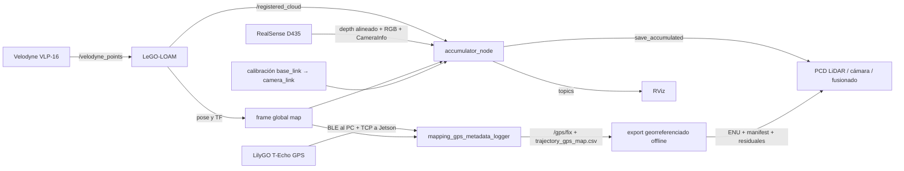

# AGV-Mapping

Wiki técnica del sistema de mapeo 3D para un AGV Scout. El proyecto integra un LiDAR Velodyne VLP-16, una Intel RealSense D435, LeGO-LOAM y un acumulador propio sobre ROS Melodic para generar mapas PCD LiDAR, RGB-D y fusionados.

> Esta guía describe el árbol actual del pipeline PCD.

## Índice

- [Arquitectura](#arquitectura)
- [Recorrido por el repositorio](#recorrido-por-el-repositorio)
- [Flujo de datos y TF](#flujo-de-datos-y-tf)
- [Interfaces ROS](#interfaces-ros)
- [Compilación](#compilación)
- [Uso](#uso)
- [Calibración cámara-LiDAR](#calibración-cámara-lidar)
- [Configuración](#configuración)
- [Salidas](#salidas)
- [Diagnóstico](#diagnóstico)
- [Limitaciones conocidas](#limitaciones-conocidas)
- [Desarrollo](#desarrollo)

## Arquitectura

[`catkin_ws/scripts/start_lidar_mapping.sh`](catkin_ws/scripts/start_lidar_mapping.sh) es el punto de entrada operativo. Arranca cada componente como proceso en segundo plano, guarda su PID y separa sus logs.



| Componente | Responsabilidad |
| --- | --- |
| [`start_lidar_mapping.sh`](catkin_ws/scripts/start_lidar_mapping.sh) | Orquesta sensores, LeGO-LOAM, acumulador, RViz y logs. |
| [`accumulator.cpp`](catkin_ws/src/scout_pointcloud_accumulator/src/accumulator.cpp) | Transforma, filtra, acumula, publica y guarda las nubes. |
| [`accumulate.launch`](catkin_ws/src/scout_pointcloud_accumulator/launch/accumulate.launch) | Configura el acumulador y la TF estática de cámara; no inicia sensores. |
| [`realsense_mapping.launch`](catkin_ws/src/scout_pointcloud_accumulator/launch/realsense_mapping.launch) | Configura profundidad/color alineados de RealSense. |
| [`mapping_gps_metadata.launch`](catkin_ws/src/scout_pointcloud_accumulator/launch/mapping_gps_metadata.launch) | Nodo GPS integrado en `start_lidar_mapping.sh` para recibir GPS por TCP, publicar `/gps/fix` y guardar metadatos asociados a la trayectoria `map → base_link`. |
| [`run.launch`](catkin_ws/src/LeGO-LOAM/LeGO-LOAM/launch/run.launch) | Inicia los cuatro nodos principales de LeGO-LOAM. |
| [`open_rslidar.launch`](catkin_ws/src/scout_base/scout_bringup/launch/open_rslidar.launch) | Inicia el pipeline Velodyne y la TF `base_link → velodyne`. El nombre es histórico. |

El acumulador realiza seis pasos: carga parámetros; crea los suscriptores habilitados; transforma cada medida a `target_frame`; aplica filtros voxel independientes; publica nubes instantáneas/acumuladas; y escribe PCD al recibir el servicio de guardado.

## Recorrido por el repositorio

```text
AGV-Mapping/
├── README.md                         esta wiki
├── catkin_ws/
│   ├── scripts/                      operación, vistas, diagnóstico y calibración
│   └── src/
│       ├── scout_pointcloud_accumulator/  código propio de acumulación/fusión
│       ├── LeGO-LOAM/                registro y odometría LiDAR
│       ├── velodyne/                 driver y conversión del VLP-16
│       ├── realsense/                driver ROS de RealSense
│       ├── scout_base/ y ugv_sdk/    soporte del AGV AgileX
│       ├── navigation/               GMapping y conversión a LaserScan
│       └── rf2o_laser_odometry/      odometría láser 2D alternativa
├── maps/                             mapas generados
├── agv_mapping/                      PID y logs de ejecución
└── agv_mapping_test/                 evidencia de pruebas de campo
```

El código específico del proyecto se concentra en [`scout_pointcloud_accumulator`](catkin_ws/src/scout_pointcloud_accumulator/). Los demás subárboles son algoritmos, drivers y paquetes ROS integrados.

## Flujo de datos y TF

### LiDAR

```text
/velodyne_points → LeGO-LOAM → /registered_cloud → TF a map
→ eliminación de puntos inválidos → voxel grid → nube acumulada → PCD
```

### Cámara

Por defecto, el acumulador consume la nube XYZRGB nativa:

- `/camera/depth/color/points`

La ruta alternativa por profundidad alineada usa:

- `/camera/aligned_depth_to_color/image_raw`
- `/camera/color/image_raw`
- `/camera/color/camera_info`

Los puntos se limitan por rango, se transforman a `map`, se submuestrean y se incorporan a la nube RGB.

### Transformaciones

El frame global y `Fixed Frame` de RViz es `map`. La cadena crítica es conceptualmente:

```text
map → trayectoria LeGO-LOAM → base_link → camera_link → frames ópticos RealSense
```

La extrínseca de cámara se carga desde [`camera_lidar_calibration.yaml`](catkin_ws/src/scout_pointcloud_accumulator/config/camera_lidar_calibration.yaml). Una TF incorrecta produce desplazamiento, doble pared o un abanico vertical.

## Interfaces ROS

### Entradas

| Topic | Uso |
| --- | --- |
| `/velodyne_points` | Nube cruda que consume LeGO-LOAM. |
| `/registered_cloud` | Nube LiDAR registrada que consume el acumulador. |
| `/camera/aligned_depth_to_color/image_raw` | Profundidad alineada con RGB. |
| `/camera/color/image_raw` | Imagen de color. |
| `/camera/color/camera_info` | Intrínsecos de cámara. |
| `/camera/depth/color/points` | Entrada alternativa `PointCloud2` de cámara. |
| TCP `gps_tcp_port` | Muestras GPS reenviadas desde el PC operador; por defecto puerto `29500`. |

### Salidas

| Topic o servicio | Contenido |
| --- | --- |
| `/accumulated_points` | Alias histórico de la nube LiDAR acumulada. |
| `/accumulated_lidar_points` | LiDAR acumulado XYZ + intensidad. |
| `/accumulated_camera_points` | Cámara acumulada XYZRGB. |
| `/camera/colored_points` | Nube RGB instantánea reconstruida. |
| `/agv/direction_marker` | Flecha y etiqueta que indican en RViz el frente detectado del AGV. |
| `/gps/fix` | Fix GPS aceptado por el sidecar. |
| `/gps_map_trajectory_path` | Trayectoria diagnóstica de pares GPS/TF aceptados. |
| `/accumulator_node/save_accumulated` | Servicio `std_srvs/Empty` que guarda los PCD. |
| `/mapping_gps_metadata_logger/save_metadata` | Servicio del sidecar GPS que fuerza el manifest. |

## Compilación

Requisitos principales: ROS Melodic, Catkin, PCL, los drivers del Velodyne/RealSense y acceso al hardware. ROS Melodic suele ejecutarse sobre Ubuntu 18.04; las versiones exactas del SDK y firmware no están fijadas en el repositorio.

```bash
cd catkin_ws
source /opt/ros/melodic/setup.bash
catkin_make --pkg lego_loam scout_pointcloud_accumulator
source devel/setup.bash
```

Para compilar todos los paquetes, sustituya el comando por `catkin_make`.

## Uso

Los comandos parten de la raíz del repositorio.

### Iniciar

```bash
cd catkin_ws
./scripts/start_lidar_mapping.sh
```

Por defecto, los mapas se escriben en `../maps`, los logs en `../agv_mapping/logs` y los PID en `../agv_mapping/pids`.

Variantes:

```bash
# Sin RViz
RVIZ=false ./scripts/start_lidar_mapping.sh

# Solo LiDAR o solo cámara en los archivos de salida
SAVE_LIDAR=true SAVE_CAMERA=false ./scripts/start_lidar_mapping.sh
SAVE_LIDAR=false SAVE_CAMERA=true ./scripts/start_lidar_mapping.sh

# Directorio de salida explícito
./scripts/start_lidar_mapping.sh /ruta/a/mapas
```

### Guardar y detener

```bash
./scripts/save_accumulated_map.sh
./scripts/stop_lidar_mapping.sh
```

La parada intenta guardar primero y aplica un timeout de 30 segundos. Si el sidecar GPS está activo, ambos scripts también llaman a `/mapping_gps_metadata_logger/save_metadata`; si ese guardado falla, devuelven código no cero. `stop_lidar_mapping.sh` aun así continúa apagando nodos para no dejar el sistema vivo a medias. Si el sidecar no está activo, continúan sin error. Para una sesión importante, guarde explícitamente y compruebe el resultado antes de detener.

### GPS LilyGO T-Echo automático

La geolocalización GPS se lanza automáticamente desde `start_lidar_mapping.sh` como sidecar ROS en la Jetson. No mete dependencias BLE dentro de ROS: el Bluetooth sigue viviendo en el PC operador. La arquitectura esperada es:

```text
LilyGO T-Echo en el AGV → Bluetooth al PC operador → TCP por LAN a Jetson → nodo ROS GPS → metadatos + export offline
```

En la Jetson, lance mapeo y receptor GPS juntos indicando la IP del PC operador:

```bash
cd catkin_ws
source /opt/ros/melodic/setup.bash
source devel/setup.bash

GPS_ALLOWED_HOSTS=192.168.8.10 ./scripts/start_lidar_mapping.sh
```

Por defecto el arranque integrado usa `ENABLE_GPS=true`, `GPS_TCP_BIND=0.0.0.0` y `GPS_TCP_PORT=29500`; por seguridad exige `GPS_ALLOWED_HOSTS` para abrirse a la LAN. Para desactivar el sidecar GPS en una sesión concreta:

```bash
ENABLE_GPS=false ./scripts/start_lidar_mapping.sh
```

Cada ejecución crea una carpeta de sesión `maps/map_YYYYMMDD_HHMMSS/`. Dentro quedan juntos los tres mapas PCD, el manifest del acumulador y los CSV/JSONL GPS. Variables útiles del arranque integrado: `SESSION_NAME`, `SESSION_DIR`, `ENABLE_GPS`, `GPS_METADATA_DIR`, `GPS_TCP_BIND`, `GPS_TCP_PORT`, `GPS_ALLOWED_HOSTS`, `GPS_MIN_SATS`, `GPS_MAX_HDOP`, `GPS_MAX_AGE_MS`, `GPS_REQUIRE_FIX`, `GPS_REQUIRE_SATS`, `GPS_REQUIRE_HDOP`, `GPS_REQUIRE_AGE`, `GPS_ASSOCIATION_MAX_AGE_SEC`, `GPS_TF_WAIT_TIMEOUT_SEC`, `GPS_MAX_LINE_BYTES`, `GPS_FRAME`, `GPS_ROBOT_FRAME`, `GPS_DATUM_LATITUDE`, `GPS_DATUM_LONGITUDE` y `GPS_DATUM_ALTITUDE`.

En el PC operador, primero identifique el LilyGO y capture evidencia:

```bash
python3 catkin_ws/scripts/lilygo_ble_probe.py \
  --name LilyGO,T-Echo \
  --scan-seconds 15 \
  --listen-seconds 30 \
  --output /tmp/lilygo_probe.jsonl
```

Después reenvíe las notificaciones BLE a la Jetson. Use en `--jetson-host` la IP real de la Jetson y asegúrese de que `GPS_ALLOWED_HOSTS` en la Jetson contiene la IP del PC:

```bash
python3 catkin_ws/scripts/lilygo_ble_tcp_bridge.py \
  --address XX:XX:XX:XX:XX:XX \
  --jetson-host 192.168.8.174 \
  --jetson-port 29500 \
  --listen-seconds 0 \
  --output /tmp/lilygo_bridge.jsonl
```

El logger acepta líneas JSON, pares `clave=valor` y frases NMEA tipo GGA/RMC. Campos normalizados: `latitude`, `longitude`, `altitude`, `sats`, `hdop`, `fix_ok`, `measurement_age_ms`, `raw_text` y `raw_hex`. Las muestras se aceptan sólo si tienen latitud/longitud, fix válido cuando `gps_require_fix=true`, al menos `gps_min_sats`, `hdop <= gps_max_hdop` y edad menor o igual a `gps_max_age_ms`. El `time_utc` del bridge BLE es sólo tiempo de transporte y no sustituye `age_ms`/`measurement_age_ms`; si no llega una edad explícita, la muestra se rechaza con `missing_age`. La asociación con la trayectoria usa `estimated_measurement_ros_time`, no el instante de recepción; si la edad supera `gps_association_max_age_sec` o no hay TF para ese timestamp, `trajectory_gps_map.csv` deja `tf_ok=0` y rellena `association_rejection_reason`.

La carpeta de sesión en `maps/map_YYYYMMDD_HHMMSS/` contiene:

| Archivo | Contenido |
| --- | --- |
| `gps.csv` | Todas las muestras normalizadas con motivo de rechazo si aplica. |
| `gps_raw.jsonl` | Payload original más envelope de recepción. |
| `trajectory_gps_map.csv` | Muestras aceptadas y su intento de asociación a TF `map → base_link` en el timestamp estimado de medida. |
| `manifest.json` | Umbrales, frames, contadores, datum policy y rutas GPS generadas. |
| `map_YYYYMMDD_HHMMSS_lidar.pcd` | Mapa LiDAR. |
| `map_YYYYMMDD_HHMMSS_camera.pcd` | Mapa cámara RGB-D aceptado por quality gates. |
| `map_YYYYMMDD_HHMMSS_fused_quality.pcd` | Mapa fusionado quality. |
| `map_YYYYMMDD_HHMMSS_manifest.json` | Manifest del snapshot PCD. |

Para generar productos georreferenciados offline:

```bash
python3 catkin_ws/src/scout_pointcloud_accumulator/scripts/georeference_lidar_map.py \
  --trajectory maps/map_YYYYMMDD_HHMMSS/trajectory_gps_map.csv \
  --pcd maps/map_YYYYMMDD_HHMMSS/map_YYYYMMDD_HHMMSS_lidar.pcd \
  --datum-latitude 38.000000 \
  --datum-longitude -4.000000 \
  --datum-altitude 100.0 \
  --output-dir maps/map_YYYYMMDD_HHMMSS/georef \
  --output-prefix map_YYYYMMDD_HHMMSS
```

El exportador usa WGS84 a ENU con datum manual o con `datum_policy` manual leído desde `--metadata-manifest`. El origen `first_valid_fix` sólo está permitido si se pasa `--allow-first-fix-datum`, para exportación exploratoria no reproducible. El ajuste es una similitud 2D más offset vertical entre `map` y ENU, y escribe manifest con `pair_count`, escala, yaw y residuales. Sólo exporta PCD ASCII; si recibe un PCD binario lo informa como no exportado en `warnings` en vez de fingir soporte.

Para visualizar la ruta GPS/TF superpuesta a la nube LiDAR en el frame `map`, genere un HTML offline:

```bash
python3 catkin_ws/src/scout_pointcloud_accumulator/scripts/visualize_gps_lidar_route.py \
  --trajectory maps/map_YYYYMMDD_HHMMSS/trajectory_gps_map.csv \
  --pcd maps/map_YYYYMMDD_HHMMSS/map_YYYYMMDD_HHMMSS_lidar_ascii.pcd \
  --output maps/map_YYYYMMDD_HHMMSS/route_lidar_view.html
```

El visor muestra la nube en vista superior, la ruta del AGV y una tabla con `latitude`, `longitude`, `map_x`, `map_y`, `hdop` y satélites para cada fix asociado. Haga click sobre un punto de ruta para ver su coordenada GPS.

### Visualizar

```bash
rviz -d src/scout_pointcloud_accumulator/rviz/accum.rviz
./scripts/view_realsense.sh
./scripts/view_rgb_camera.sh
./scripts/view_latest_pcd.sh ../maps
```

## Calibración cámara-LiDAR

El modo de calibración inicia ambos sensores y permite ajustar interactivamente `base_link → camera_link`. No arranca el acumulador ni guarda mapas.

```bash
cd catkin_ws
./scripts/start_camera_lidar_calibration.sh
```

Órdenes: `x+`, `x-`, `y+`, `y-`, `z+`, `z-`, `roll+`, `pitch+`, `yaw+`, `step`, `rstep`, `show`, `save` y `quit`. `save` actualiza [`camera_lidar_calibration.yaml`](catkin_ws/src/scout_pointcloud_accumulator/config/camera_lidar_calibration.yaml). La vista está en [`calibration.rviz`](catkin_ws/src/scout_pointcloud_accumulator/rviz/calibration.rviz).

## Configuración

| Variable | Valor inicial | Efecto |
| --- | --- | --- |
| `TARGET_FRAME` | `map` | Frame común de acumulación. |
| `CAMERA_VISUALIZATION_FRAME` | `camera_depth_optical_frame` | Frame de la nube instantánea; permite ver la cámara sin depender de la odometría LiDAR. |
| `RVIZ_FIXED_FRAME` | `camera_depth_optical_frame` | Frame inicial de RViz; use `map` si la TF global ya está disponible al arrancar. |
| `LIDAR_TOPIC` | `/registered_cloud` | Entrada LiDAR registrada. |
| `LIDAR_RAW_TOPIC` | `/velodyne_points` | Entrada LiDAR instantánea y topic usado para validar paquetes al arrancar. |
| `LIDAR_DEVICE_IP` | `192.168.8.201` | Dirección del VLP-16 aceptada por el driver. |
| `LIDAR_HOST_IP` | `192.168.8.174` | Destino configurado en el VLP-16; debe estar asignado al Xavier. |
| `LIDAR_DATA_PORT` | `2368` | Puerto UDP de datos del VLP-16. |
| `LIDAR_READY_TIMEOUT` | `15` s | Espera máxima de paquetes LiDAR antes de abortar con diagnóstico de red. |
| `ENABLE_LIDAR`, `ENABLE_CAMERA` | `true`, `true` | Habilita cada fuente. |
| `SAVE_LIDAR`, `SAVE_CAMERA` | `true`, `true` | Controla los PCD generados. |
| `LIDAR_VOXEL_SIZE` | `0.05` m | Resolución del mapa LiDAR. |
| `CAMERA_VOXEL_SIZE` | `0.05` m | Resolución del mapa RGB. |
| `CAMERA_VISUALIZATION_VOXEL_SIZE` | `0.02` m | Resolución RGB para RViz. |
| `CAMERA_ACCUMULATE_RATE` | `1.0` Hz | Frecuencia de incorporación al mapa. |
| `CAMERA_MIN_RANGE`, `CAMERA_MAX_RANGE` | `0.20`, `3.0` m | Profundidad aceptada. |
| `CAMERA_DEPTH_PIXEL_STEP` | `2` | Submuestreo de profundidad. |
| `CAMERA_CALIBRATION_FILE` | YAML del paquete | Extrínseca de cámara. |
| `TRANSFORM_TIMEOUT` | `0.5` s | Espera máxima de TF. |
| `USE_LATEST_TF_ON_FAILURE` | `false` | Usa la última TF como fallback; puede ocultar fallos temporales. |
| `REALSENSE_INITIAL_RESET` | `false` | Evita reiniciar la cámara en cada arranque; actívelo sólo para recuperación explícita. |
| `CAMERA_READY_SAMPLE_MESSAGES` | `4` | Mensajes consecutivos exigidos para considerar estable una nube de cámara. |
| `CAMERA_READY_SAMPLE_TIMEOUT_SEC` | `5` s | Tiempo máximo para recibir esa muestra; tolera el arranque del suscriptor sin aceptar flujos detenidos. |
| `REALSENSE_READY_TIMEOUT` | `30` s | Límite para validar depth, color y CameraInfo. |
| `CAMERA_OUTPUT_READY_TIMEOUT` | `30` s | Límite para validar `/camera/colored_points` tras arrancar el acumulador. |
| `LEGO_USE_IMU` | `false` | Activa la IMU de LeGO-LOAM. |
| `LEGO_LOCK_ROLL_PITCH` | `true` | Limita deriva de roll/pitch. |
| `ENABLE_GPS` | `true` | Lanza el sidecar GPS junto con `start_lidar_mapping.sh`; use `false` para sesiones sin GPS. |
| `GPS_ALLOWED_HOSTS` | vacío | IPs del PC operador autorizadas para enviar GPS a la Jetson; obligatorio si `GPS_TCP_BIND` no es loopback. |
| `SESSION_DIR` | `maps/map_YYYYMMDD_HHMMSS` | Carpeta única de sesión para PCD, manifests y GPS. |
| `GPS_METADATA_DIR` | igual que `SESSION_DIR` | Carpeta de metadatos GPS de la sesión. |
| `GPS_MIN_SATS` | `4` | Satélites mínimos aceptados por el sidecar GPS. |
| `GPS_MAX_HDOP` | `5.0` | HDOP máximo aceptado. |
| `GPS_MAX_AGE_MS` | `2000` ms | Edad máxima de la medida reenviada. |
| `GPS_REQUIRE_FIX` | `true` | Rechaza muestras sin fix válido. |
| `GPS_REQUIRE_SATS`, `GPS_REQUIRE_HDOP`, `GPS_REQUIRE_AGE` | `true` | Exige que los campos de calidad existan, no sólo que estén dentro de umbral cuando aparecen. |
| `GPS_ASSOCIATION_MAX_AGE_SEC` | `2.0` s | Ventana nominal de asociación GPS/TF documentada en el manifest. |
| `GPS_TF_WAIT_TIMEOUT_SEC` | `0.5` s | Espera máxima de TF al buscar `map → base_link` en el timestamp estimado de medida. |
| `GPS_MAX_LINE_BYTES` | `8192` | Tamaño máximo de una línea TCP antes de cerrar o descartar el payload. |

`CAMERA_PARENT_FRAME`, `CAMERA_CHILD_FRAME`, `CAMERA_XYZ` y `CAMERA_RPY` definidos en el entorno prevalecen sobre el YAML.

## Salidas

Una sesión usa una carpeta como `maps/map_YYYYMMDD_HHMMSS/` y escribe:

| Archivo | Formato |
| --- | --- |
| `*_lidar.pcd` | LiDAR `PointXYZI`. |
| `*_camera.pcd` | RealSense `PointXYZRGB`. |
| `*_fused_quality.pcd` | LiDAR convertido a gris + cámara RGB aceptada por quality gates. |
| `manifest.json` | Manifest GPS del sidecar. |
| `gps.csv`, `gps_raw.jsonl`, `trajectory_gps_map.csv` | Metadatos GPS y asociación GPS/TF. |
| `*_trajectory_enu.csv` | Trayectoria GPS convertida a ENU por el exportador offline. |
| `*_points_enu.csv` | Puntos CSV transformados a ENU, si se usa `--points-csv`. |
| `*_lidar_enu_ascii.pcd` | PCD ASCII transformado a ENU, si se usa `--pcd`. |
| `*_georef_manifest.json` | Datum, transformada, residuales, productos y warnings del exportador. |
| `route_lidar_view.html` | Visor offline opcional con ruta GPS/TF sobre la nube LiDAR ASCII. |

`maps/`, `agv_mapping/` y `agv_mapping_test/` contienen artefactos de ejecución, no código. No conviene versionar mapas ni logs nuevos.

## Diagnóstico

### Frecuencia y servicios

```bash
rostopic hz /registered_cloud
rostopic hz /accumulated_lidar_points
rostopic hz /camera/colored_points
rostopic hz /accumulated_camera_points
rosservice list | grep save_accumulated
rostopic echo -n1 /gps/fix
rosservice call /mapping_gps_metadata_logger/save_metadata "{}"
```

### TF

```bash
rosrun tf tf_echo map camera_init
rosrun tf tf_echo map base_link
rosrun tf tf_echo map camera_link
rosrun tf tf_echo map camera_color_optical_frame
```

Si RViz indica `Fixed Frame [map] does not exist`, revise LeGO-LOAM y el nodo `/camera_init_to_map`.

### Estabilidad angular

```bash
cd catkin_ws
./scripts/check_lego_roll_pitch.py --duration 60 --warn-deg 1.0
```

### Logs

Desde la raíz del repositorio:

```bash
tail -f agv_mapping/logs/lidar.log
tail -f agv_mapping/logs/realsense.log
tail -f agv_mapping/logs/lego_loam.log
tail -f agv_mapping/logs/accumulator.log
```

| Síntoma | Primera comprobación |
| --- | --- |
| No existe `map` | Nodos y log de LeGO-LOAM. |
| No aparece LiDAR acumulado | `/registered_cloud`, TF y `accumulator.log`. |
| No aparece color | Depth alineado, RGB, CameraInfo y TF óptica. |
| Cámara desplazada | YAML de calibración y publicadores TF duplicados. |
| Mapa en abanico | Script de roll/pitch, IMU y extrínsecas. |
| No se genera `trajectory_gps_map.csv` | Verifique que el nodo GPS está lanzado, que llegan líneas TCP y que existe TF `map → base_link`. |
| Muchas muestras GPS rechazadas | Revise `rejection_reason` en `gps.csv`: `fix_not_valid`, `low_sats`, `high_hdop`, `stale_age` o `missing_lat_lon`. |
| Export georreferenciado con RMS alto | Use más pares distribuidos espacialmente, valide datum y confirme que el GPS está rígidamente situado respecto al AGV. |

## Limitaciones conocidas

- [`view_latest_pcd.sh`](catkin_ws/scripts/view_latest_pcd.sh) usa `/mnt/ros/maps` como ruta histórica si no recibe un argumento; desde `catkin_ws`, use `../maps`.
- La TF `base_link → velodyne` y los valores iniciales de cámara deben validarse físicamente antes de considerar el resultado métricamente calibrado.
- No hay tests unitarios específicos del acumulador. La verificación completa requiere sensores reales o una grabación ROS reproducible.
- La integración GPS incluida aquí está verificada con parsers, fixtures y scripts locales; falta una prueba de campo con LilyGO T-Echo real, Bluetooth del PC y Jetson en la misma red.
- La georreferenciación offline estima una transformada `map → ENU` desde pares GPS/TF; no sustituye SLAM, RTK ni una calibración temporal rigurosa.

## Desarrollo

Antes de aceptar cambios en el pipeline:

1. compile el paquete afectado;
2. confirme que `accumulator_node` permanece activo;
3. mida las entradas y salidas con `rostopic hz`;
4. verifique la cadena TF completa;
5. guarde una sesión corta y abra los tres PCD;
6. revise geometría, color, alineación y logs.

La documentación específica del paquete continúa en [`catkin_ws/src/scout_pointcloud_accumulator/README.md`](catkin_ws/src/scout_pointcloud_accumulator/README.md). Los componentes externos mantienen sus propios README y licencias en sus subárboles.
